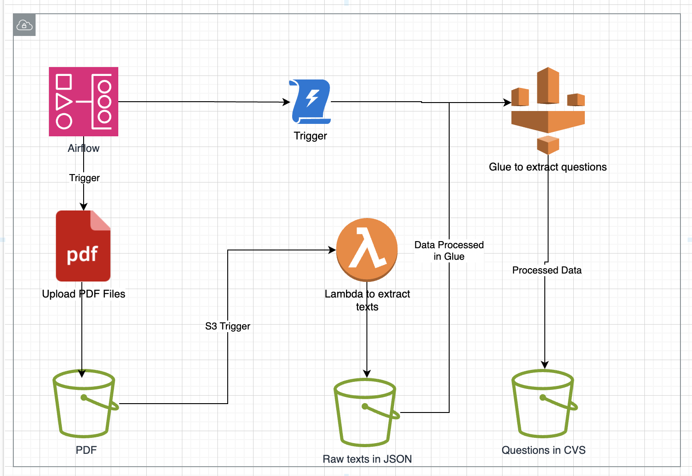

https://github.com/SiddharthUchil/data_pipeline_airflow_aws/assets/36127139/6abf0e08-6bb1-4520-92e5-6ab17579f1ce

## Technical Specifications for Demonstration

### Data Storage and Organization
- **Amazon S3**: Utilized for data storage, with data systematically categorized within distinct folders tailored to their respective purposes.

### Data Extraction Mechanism
- **AWS Lambda**: Implements functions to facilitate the extraction of data from PDF documents, converting them into a raw JSON structure.

### Data Processing Framework
- **AWS Glue**: Employed for the intricate processing of data, specifically to distill questions from the comprehensive dataset.

### Workflow Orchestration
- **Apache Airflow**: Serves as the workflow orchestrator, a robust tool designed to develop, structure, sequence, schedule, and oversee tasks through a construct known as a DAG (Direct Acyclic Graph). All DAGs are scripted in Python.

### Dataset Overview
- The dataset originates from the Brazilian ENEM (Exame Nacional do Ensino Médio), an annual examination that constitutes the primary gateway to a majority of Brazilian universities. The objective is to utilize this dataset for data extraction and question retrieval.

## Operational Steps

1. **Airflow Environment Initialization**
   - Initialize the Airflow environment by executing `docker compose up`. Ensure the execution path aligns with the location of the Docker Compose file. Access the Airflow interface via `localhost:8080`.

2. **S3 Bucket Configuration**
   - Configure an S3 bucket, designated as `datapipeline-test03`, adapting the naming convention to align with the specific use case.

3. **IAM User Creation**
   - Establish an IAM User, `datapipeline`, bestowing administrative privileges and securely storing the access key credentials.

4. **Airflow AWS Connection Setup**
   - Within the Airflow UI (`localhost:8080`), navigate to the `Admin -> Connections` tab to forge a new AWS connection, `AWSConnection`, utilizing the previously generated access key pair.

5. **Airflow File Upload Procedure**
   - In the `/dags` directory, craft a Python script, tentatively titled `process_enem_pdf.py`, to manage file uploads to AWS.

6. **Airflow Variable Configuration**
   - Define a `year` variable within the Airflow UI (`Admin -> Variables`). This variable emulates the `year` parameter, commencing in 2010, with an auto-incrementation mechanism (+1) post-task completion.

7. **Lambda Function Deployment**
   - Construct a new Lambda function, `process-enem-pdf`, opting for the Python 3.9 runtime. The function's creation process will inherently generate an IAM Role. Ascertain that this role possesses the requisite read and write permissions for the `datapipeline-test03` S3 bucket. Modify the execution duration to accommodate the processing needs.
